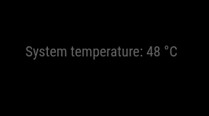

# MMM-SystemTemperature

This is a module for [MagicMirror²](https://github.com/MagicMirrorOrg/MagicMirror) that displays your system's CPU temperature on your mirror.

It also allows safe shutdown of your system using [MMM-Remote-Control](https://github.com/Jopyth/MMM-Remote-Control) if you configure it.

## Screenshot



## Installation

In your terminal, go to your MagicMirror's modules directory, clone this repository and install the dependencies:

```bash
cd ~/MagicMirror/modules
git clone https://github.com/KristjanESPERANTO/MMM-SystemTemperature
cd MMM-SystemTemperature
npm ci
```

## Update

To update this module, pull the latest changes from the repository and reinstall the dependencies:

```bash
cd ~/MagicMirror/modules/MMM-SystemTemperature
git pull
npm ci
```

## Configuration

To use this module, add it to the modules array in the `config/config.js` file:

```js
    {
      module: 'MMM-SystemTemperature',
      position: 'top_center',  // This can be any of the regions.
      classes: 'small dimmed', // Add your own styling. Optional.
      config: {
        // See 'Configuration options' for more information.
      }
    },
```

### Configuration options

The following properties can be configured:

<table width="100%">
  <thead>
    <tr>
      <th>Option</th>
      <th width="100%">Description</th>
    </tr>
  <thead>
  <tbody>
    <tr>
      <td><code>prependString</code></td>
      <td>The text that will be shown before the temperature.
        <br><b>Default value:</b> <code>'System temperature: '</code>
      </td>
    </tr>
    <tr>
      <td><code>updateInterval</code></td>
      <td>How often does the content needs to be fetched? (Milliseconds)
        <br><b>Possible values:</b> <code>1000</code> - <code>86400000</code>
        <br><b>Default value:</b> <code>5000</code> (5 seconds)
      </td>
    </tr>
    <tr>
      <td><code>animationSpeed</code></td>
      <td>Speed of the update animation. (Milliseconds)
        <br><b>Possible values:</b> <code>0</code> - <code>5000</code>
        <br><b>Default value:</b> <code>0</code> (animation off)
      </td>
    </tr>
    <tr>
      <td><code>unit</code></td>
      <td>Temperature unit of measurement
        <br><b>Possible values:</b> <code>c</code> (Celsius), <code>f</code> (Fahrenheit), <code>k</code> (Kelvin)
        <br><b>Default value:</b> <code>c</code> (Celsius)
      </td>
    </tr>
    <tr>
      <td><code>warning</code></td>
      <td>Specific config for <code>warning</code> state (triggers at or above this temperature)
        <br><b>Possible values:</b> <code>{ temp: 0-999, color: '#HEX', command: Object }</code>
        <br><b>Default value:</b> <code>{ temp: 60, color: 'orange', command: undefined }</code>
      </td>
    </tr>
    <tr>
      <td><code>critical</code></td>
      <td>Specific config for <code>critical</code> state (triggers at or above this temperature)
        <br><b>Possible values:</b> <code>{ temp: 0-999, color: '#HEX', command: Object  }</code>
        <br><b>Default value:</b> <code>{ temp: 75, color: 'red', command: { notification: 'REMOTE_ACTION', payload: { action: 'SHUTDOWN' } } }</code>
        <br><b>NOTE:</b> The <code>REMOTE_ACTION</code> notification (<code>SHUTDOWN</code> and <code>MONITOROFF</code>) actions require the <a href="https://github.com/Jopyth/MMM-Remote-Control">MMM-Remote-Control</a> module to be installed.
      </td>
    </tr>
  </tbody>
</table>

## License

This project is licensed under the ISC License - see the [LICENSE](LICENSE.md) file for details.

## Changelog

All notable changes to this project will be documented in the [CHANGELOG.md](CHANGELOG.md) file.
